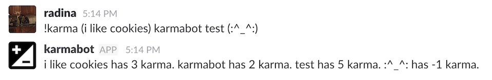
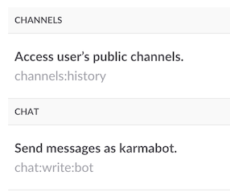

#  Karmabot
## An implementation of irc karmabot for slack

### Usage
#### Basic usage
Karmabot is always listening! O_O It will detect any instance of `[word]++` or `[word]--` and adjust the score of that word accordingly.

#### Phrases and non-word characters
Karmabot will accept anything inside one layer of parentheses as a "word" to be scored. This includes spaces and other non-word characters. 

Eg:   
Valid usages:
```
> (i like cookies)++  
> (:^_^:)++
```

Not valid and won't do anything:
```
> ((troll)))++
```

#### Fetching scores
To find out scores, just send the message `!karma` followed by any number of words or phrases in parentheses.



### Setting it up on your own server

#### Prerequisites
1. Your own box
2. Ruby
3. [Sinatra](http://www.sinatrarb.com/)
4. [Ruby MySQL DBI](http://ruby-dbi.rubyforge.org/)

#### What to do
1. Fork this repo to your server. The main files you need are:
   1. The `tmp/` directory and `config.ru` for sinatra
   2. `karmabot.rb`
   3. `tokens.rb.SAMPLE` to copy (in step 6)
2. [Create an app on your slack team(s)](https://api.slack.com/apps) called Karmabot (or whatever you want to call it!)
3. Set up the app(s) to point to your server
4. Give your app(s) the following permissions:  

5. Set up a db with tables for every slack team you're using the app on. The tables should have minimum these two columns:
   1. `thing` a text field
   2. `points` an int
6. Create a `tokens.rb` file that contains your db table names and app authentication tokens (copy tokens.rb.SAMPLE)
7. Restart your sinatra server and you're good to go!